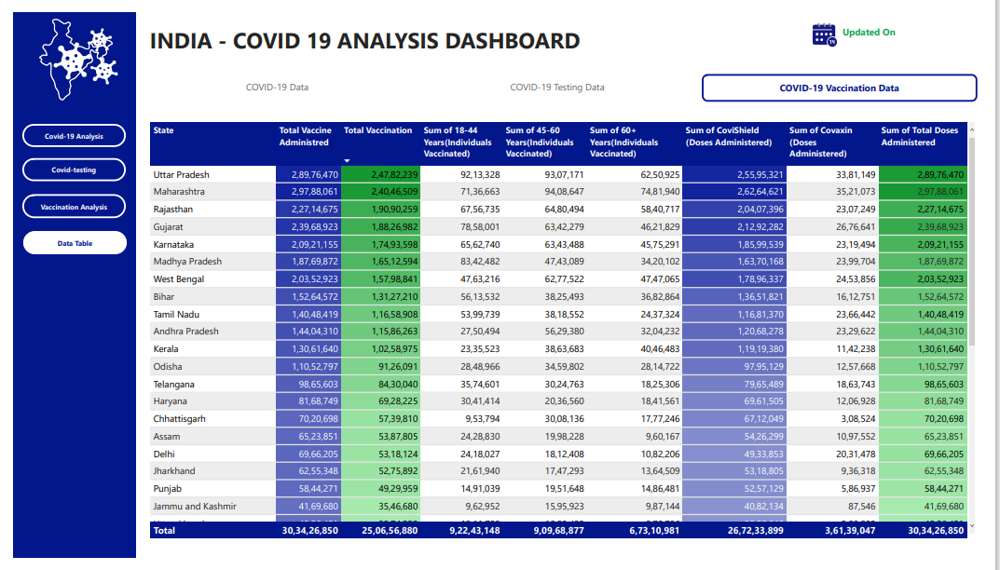

# InterCareer Intership Task 2: Power BI Dashboard Creation - COVID-19 Cases Analysis

The COVID-19 Daily Cases dataset provides information on
the daily reported COVID-19 cases, including the number of
confirmed cases, deaths, recoveries, and testing data. Your
task is to create a Power BI dashboard that offers
visualizations and insights into the COVID-19 pandemic's progression and impact.

# Task 

### 1. Daily Case Trends:
- Create visualizations that display daily trends in confirmed cases, deaths, recoveries, and
testing.
### 2. Geospatial Analysis:
- Visualize the geographic spread of COVID-19 cases on a map.
- Use color-coding to represent the severity of cases in different regions.
### 3. Comparative Analysis:
- Compare COVID-19 statistics across different countries or regions.
- Analyze the impact of measures like lockdowns or vaccination campaigns.
### 4. Interactive Dashboard:
- Build an interactive dashboard with filters for selecting countries or regions.
- Allow users to explore and analyze COVID-19 data dynamically.
### 5. Narrative and Insights:
- Provide a narrative that explains key findings from your analysis.
- Offer insights into COVID-19 trends, effects of public health measures, and vaccination
outcomes.

## Insights

- 'Maharashtra' has noticeably more Deaths 134201, Confirmed Cases 63,63,442 and recovery rate 61,59,676.
- 'Kerala' has highest deaths apprx. 1,17,5776.
- 'UttarPradesh' has highest vaccination done 2,47,83,239.
-  Male(Individuals Vaccinated) is trending upward by the recent last week.
-  'W 27' and 'W 26' have noticeably more TotalSamples for State 'Jharkhand'.
-  'Chandigarh' has a relatively steady percent of total 18-44 Years(Individuals Vaccinated) .
-  Noticebely month 'JULY' has more confirmed,recover and death cases after that we can notice the significant downtrend in these cases.
-  91 percent apprx. 251 million peoples has administred for CovidShield Dose.
-  'Maharashtra' has noticebly more positive samples.
-  Overall recovery rate is 97 percent.

### Impact of Lockdown - Date 25/March/2020 to 31/July/2020

- 'July' month highest Total samples, Positive and negative samples after this we can we overall downtrend in all.
- In Confirm ,Recovery and death cases, we notive the repidly upword trend between 'March' to 'May' month then after July we can see significant downtrends in all cases.

  

